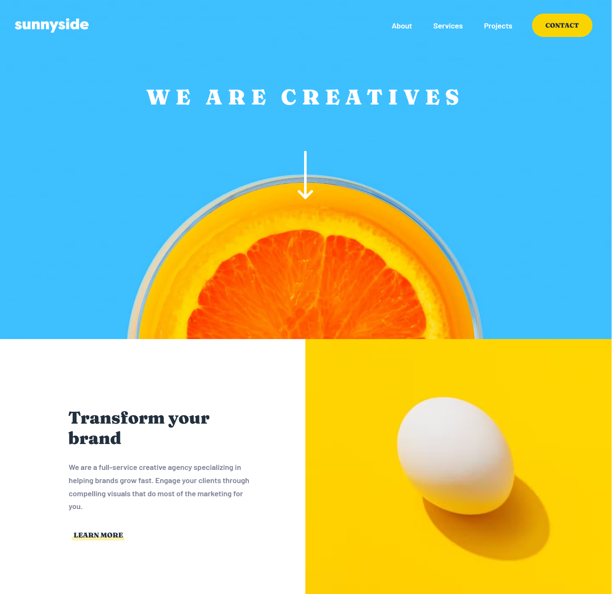
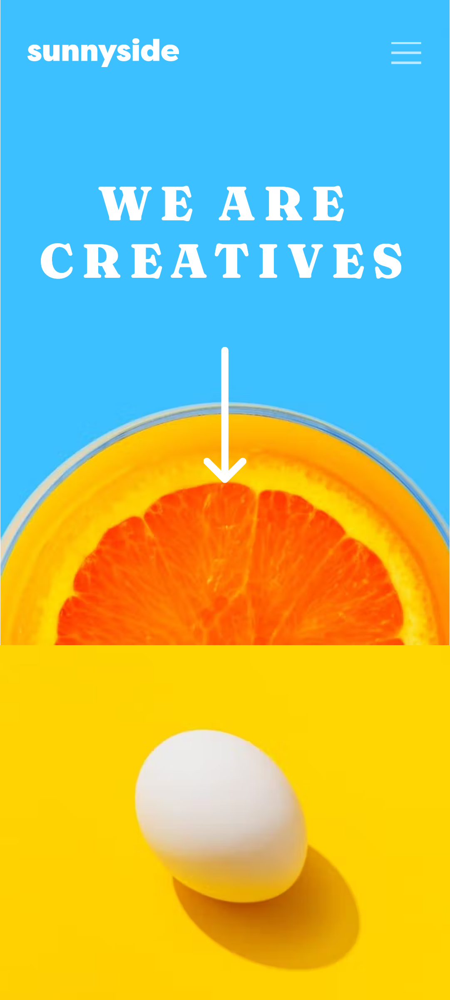

# Frontend Mentor - Sunnyside agency landing page solution

This is a solution to the [Sunnyside agency landing page challenge on Frontend Mentor](https://www.frontendmentor.io/challenges/sunnyside-agency-landing-page-7yVs3B6ef). Frontend Mentor challenges help you improve your coding skills by building realistic projects.

## Table of contents

- [Overview](#overview)
  - [The challenge](#the-challenge)
  - [Screenshot](#screenshot)
  - [Links](#links)
- [My process](#my-process)
  - [Built with](#built-with)
  - [Useful resources](#useful-resources)
- [Author](#author)

## Overview

### The challenge

Users should be able to:

- View the optimal layout for the site depending on their device's screen size
- See hover states for all interactive elements on the page

### Screenshot

Desktop

Mobile

### Links

- Solution URL: [Solution - github](https://github.com/serfoll/sunnyside-agency)
- Live Site URL: [Sunnyside Agency - heroku](https://sunnyside-ag3ncy.herokuapp.com/)

## My process

### Built with

- Semantic HTML5 markup
- SASS
- Flexbox
- CSS Grid
- Mobile-first workflow
- [Prismic](https://prismic.io/) - Prismic
- [Babel.js](https://babeljs.io/) - Javascript Compiler
- [Webpack](webpack.js.org/) - Module Bundler

### Useful resources

- [Prismic Documentation](https://prismic.io/docs) - Came in cluth throughtout the whole project from start to finish except when styling.

## Author

- Frontend Mentor - [@yourusername](https://www.frontendmentor.io/profile/serfoll)
- Twitter - [@yourusername](https://www.twitter.com/sergio_fol)
